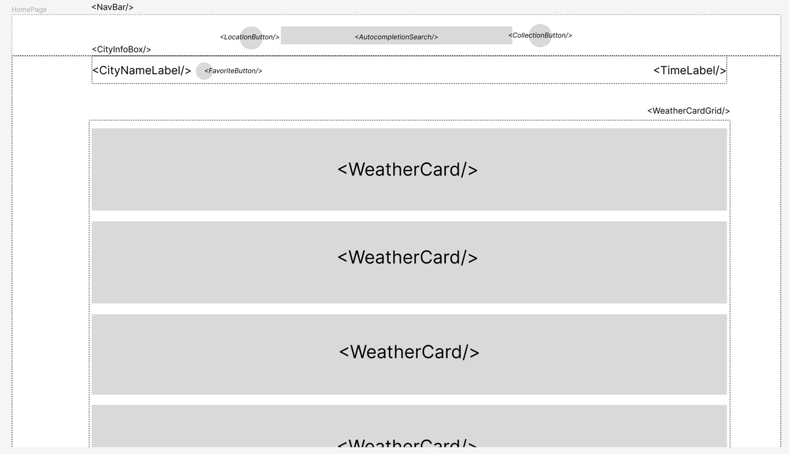
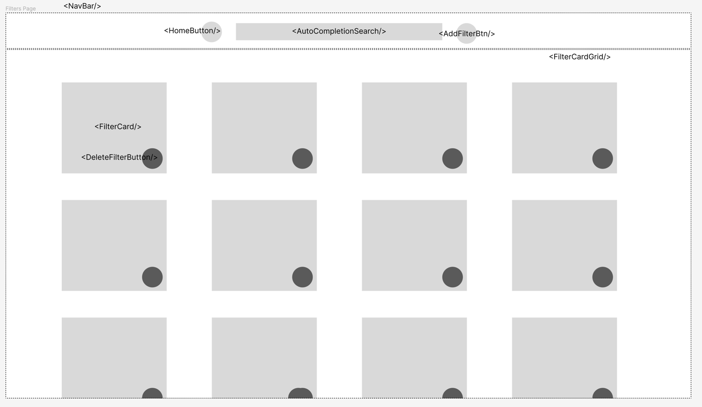

# Wealook (Weather Look)

Is an platform where user can check the weather condition of locations around the world.

## User Stories
#### As a user, I want to...
* see **current** weather condition of my "home" city.
* set a city as my "home" city 
* see **current** weather condition of the city I chose.
* see the **5 days forecast** of my "home" city.
* see the **5 days forecast** of the city I chose.
* see the current weather condition of multiple cities which I chose.
* see the 5 days forecast weather condition of multiple cities which I chose.

#### As a travel agency, I want to present my customers...
* current weather condition of a collection of cities that I created before hand.
* 5 days forecast weather condition of a collection of cities that I created before hand.
* a table of cities collections that match my customer's preferences.
* create a collection of cities match my customer's needs.

(Note: beside the specific use cases, a travel agency also have all the use cased like a normal user)

## Design

* The app should be design around a concept of **filters**.
* A filter is the user's preferences for criterias to build up the list of cities.
* A filter can include the following criterias:
    * Lists of prefer regions and cities
    * Temperature range
    * Weather condition like Rainy, Cloudy, Sunny, Stormy.
* User then have a collection of those filters with naming.

### Criteria:
* The application should be SaaS and don't provide on-premise option
* White labeling for integration with different travel agency
* Support OAuth2

### Use cases:
* Get user current "home" location base on IP / Location Service
* Store user "home" location
* Get current weather condition of city X
* Get midday 5 days forecast weather condition of city X
* Get list of all user's filters
* Delete a user filter
* Create a user filter
* Update a user filter
* Get details of user's filter F
* Get current weather condition of cities base on user's filter F
* Get 5 days forecast weather condition of cities base on user's filter F

### Resources \& Models 
#### d_location
* id 
* city 
* country 
* capital
#### f_user_preference (GPDR compliance -> only userId should be preferenced)
* id
* user_id
* home_location_id
#### f_filter
* id
* filter_name
* user_id
* temp_from
* temp_to
* weather_cond
#### f_weather
* location_id (index by this)
* repoch (received dt - UTC)
* temp
* temp_min
* temp_max
* feels_like
* humidity
* wcond_id
* cloudiness
* wind_speed
* wind_gust
* visibility
* rainvol_3h
* snowvol_3h
* rdate (YYYY-MM-DD, partition by this)

### Rest API 
- /api/v1 (versioning)
    - /userpref/:userid
      - GET: get user preference
        - Example return:
          ```
          { 
            result: <HTTP_CODE>,
            message: "successful",
            data: {
              user_id: "userid1",
              home_location_id: "locationid_01"
            }
          }
          ```
      - PUT: update user preference
        - Example payload:
          ```
          {
            user_id: "userid1", 
            home_location_id: "locationid_02"
          }
          ```
        - Example return:
          ```
          {
            result: <HTTP_CODE>, 
            message: "successful"
          }
          ```
    - /filters/:userid
      - GET: get all user's filters -> return list of :filterid
        - Example return:
          ```
          { 
            result: <HTTP_CODE>, 
            message: "successful", 
            data: {
              filters: [
                "filterid_01", "filterid_02"
              ]
            }
          }
          ```
      - POST: create new filters    -> return new :filterid
        - Example payload:
          ```
          {
            filter_id: "", 
            filter_name: "Rainy cities in Europe"
          }
          ```
        - Example return:
          ```
          {
            result: <HTTP_CODE>, 
            message: "successful", 
            data: {
              filterid: "filterid_new"
            }
          }
          ```
    - /filters/:userid/:filterid 
      - GET: get filter's detail (:filterid)
        - Example return:
          ```
          { 
            result: <HTTP_CODE>,
            message: "successful",
            data: {
              filter_id: "newfilter_id01",
              filter_name: "Rainy cities in Europe",
              temp_from: "25",
              temp_to: "35",
              weather_cond: "rainy",
            }
          }
          ```
      - PUT: update filter's detail
        - Example payload:
          ```
          { 
            filter_id: "newfilter_id01", 
            filter_name: "Rainy cities in Europe", 
            temp_from: "35", 
            temp_to: "45", 
            weather_cond: "rainy", 
          }
        - Example return:
          ```
          {
            result: <HTTP_CODE>, 
            message: "successful",
          }
          ```
    - /cities                   
      - GET: get all cities -> list of all
        - Example return:
          ```
          {
            result: <HTTP_CODE>, 
            message: "successful", 
            data: { 
              cities: [ 
                { 
                  id: "", 
                  city: "", 
                  country: "", 
                  capital: "", 
                } 
              ] 
             } 
          }
          ``` 
    - /weather/s/:locationid       
      - GET: get 5 day forecast weather for location (:locationid)
        - Example return:
          ```
          {
            result: <HTTP_CODE>, 
            message: "successful", 
            data: { 
                weather: [ 
                  { 
                    location_id: "",
                    repoch: "",
                    temp: "",
                    feels_like: "",
                    temp_min: "", 
                    temp_max: "", 
                    humidity: "", 
                    wcond_id: "", 
                    cloudiness: "", 
                    wind_speed: "", 
                    wind_gust: "", 
                    visibility: "", 
                    rainvol_3h: "", 
                    snowvol_3h: "", 
                    rdate: "", 
                  } 
                ] 
            }
          }
          ```
    - /weather/m/:filterid         
      - GET: get 5 day forecast weather for all cities by filter (:filterid)
        - Example return:
          ```
          {
            result: <HTTP_CODE>, 
            message: "successful", 
            data: { 
              cities: [ 
                { 
                  location_id: "", 
                  city: "", 
                  country: "", 
                  capital: "", 
                } 
              ], 
              weather: [ 
                   { 
                     location_id: "", 
                     repoch: "", 
                     temp: "", 
                     feels_like: "", 
                     temp_min: "", 
                     temp_max: "", 
                     humidity: "", 
                     wcond_id: "", 
                     cloudiness: "", 
                     wind_speed: "", 
                     wind_gust: "", 
                     visibility: "", 
                     rainvol_3h: "", 
                     snowvol_3h: "", 
                     rdate: "", 
                   } 
              ]
            } 
          }
          ``` 

### UI

#### Tech-Stack
* Webapp (HTML / JS / CSS)
* React
* React-Router
* Material-UI
* Redux

### Wireframe

#### Pages
* Home
  
* FilterCollection
  
* Filter

#### Usage Flow
* At beginning:
  * User will be landing on **Home** page.
* At **Home** Page:
  * User landing at **Home** page, and the weather condition for next 5 days will be shown on each **WeatherCard**.
  * User search for city they want to see the weather on **NavBar/AutoCompletionSearch**.
  * User press **LocationButton** to set back to their current location.
  * User press **CollectionButton** to navigate to **FilterCollection** page.
* At **FilterCollection** Page:
  * User press **HomeButton** to navigate back to **Home** page.
  * User search for filter by name on **NavBar/AutoCompletionSearch**.
  * User press **AddFilterBtn** to add new filter, this will navigate User to the **Filter** page of that new filter.
  * User press **FilterCard** to navigate to **Filter** page of that filter.
  * User press **FilterCard/DeleteFilterBtn** to delete a filter from the their filter collection.
* At **Filter** Page:
* 

### UI-Components
* Card
  * WeatherCard
  * FilterCard
* Button
  * HomeButton
  * LocationButton
  * DeleteOneButton
  * DeleteAllButton
  * CollectionButton
* Bar
  * TopBar
    * ButtonLeft
    * AutoCompletionSearchField
    * ButtonRight
  * SideBar

### Backend

##### Tech-Stack
* Python 3.10
* Django
* Django Rest Framework

##### Components
* WeatherApiPort (Interface) -> define method for interacting with weather api
  * OpenWeatherApiAdapater (Implementation) -> implementation for calling openweather api
* Repository (ORM and auto wired by Django)
* Cache
  * CacheWithTimeout -> data will be invalidate after 1h/3h and new DB query is needed
* Services
  * WeatherService -> 
  * LocationService -> get from Cache and filter base on filter criteria
* RestController -> 

##### Those are core component which is possible for extending in future when we use event for:
* change command from RestController will fire an event, then Repository will action on that event to update DB.
* weather api adapater is call periodically to get weather data and fire an event so that Repository will know to persist the new data to DB.
* successful update transaction from Repository will fire an event to inform Cache to update it local cache object.
* query for data should should try from Cache object first, if miss then call Repository to get data from DB.


### Database
* DBMS: PostgreSQL 14 (Google Cloud Platform Managed SQL)

